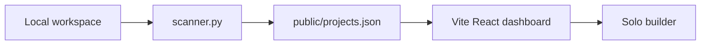
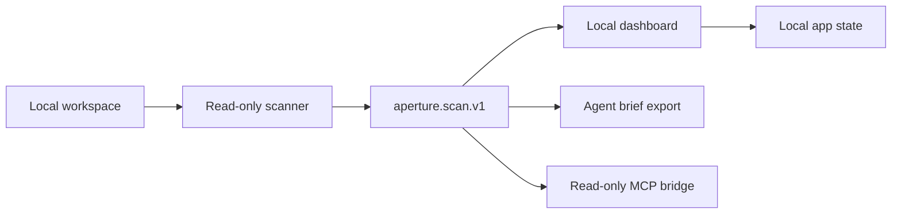

# Public Architecture

This document describes how Aperture should be explained and structured in public. It is not a full implementation spec; it is the shared map for keeping the project understandable as more project surfaces arrive.

## Architecture Promise

Aperture is a local-first workspace observability app. The public architecture should make three boundaries obvious:

- **Scanner:** reads local project facts and writes the `aperture.scan.v1` contract.
- **Dashboard:** renders the Projects, Workspace, and Brief lenses from scanner data plus local app metadata.
- **Agent bridge:** future read-only MCP surface that exposes the same facts to coding agents.

The scanner contract is the center. Dashboard and MCP should consume it instead of inventing parallel project models.

## Current System

Current limitations:

- No hosted service.
- No billing.
- No GitHub or GitLab connector.
- No database.
- No write-capable MCP tools.
- No automatic code mutation.

## V1 Target

V1 should add usefulness without breaking trust:

- Discovery review for candidate, tracked, ignored, reference, sleeping, and archived projects.
- Projects lens with per-project overview, signals, drift, and brief tabs.
- Workspace lens for scan source, mapped projects, baseline, setup coverage, and open signals.
- Brief lens with one actionable queue for setup, risk, Git, and reference signals.
- Advisory reference differences.
- Setup and hygiene signals with evidence and confidence labels.
- Copyable agent briefs.
- Read-only MCP tools after the local workflow is trustworthy.

## Project Boundaries

### Scanner Boundary

The scanner may:

- Read project markers, package files, lockfiles, Git metadata, docs, env file presence, CI paths, and conservative text hints.
- Run read-only Git commands.
- Write scanner output only to the requested output path.

The scanner should not:

- Modify scanned projects.
- Install dependencies.
- Run project scripts.
- Upload scan results.
- Treat heuristic findings as proven vulnerabilities.

### Dashboard Boundary

The dashboard may:

- Load scanner output.
- Persist local UI/project state.
- Explain findings and skipped checks.
- Generate copyable summaries and briefs.

The dashboard should not:

- Claim a connector or MCP server is live before it exists.
- Hide evidence behind abstract scores.
- Present future features as current behavior.

### Agent Boundary

The future agent bridge may expose read-only facts and briefs. Write tools, auto-fixes, and multi-agent orchestration are future ideas, not V1 architecture.

## Public Vocabulary

Use these terms consistently:

- **Projects:** factual project inventory plus per-project overview, signals, drift, and brief.
- **Workspace:** overall local workspace state, scan source, baseline, and coverage.
- **Brief:** actionable cross-project queue and compact context for a coding agent.
- **Reference differences:** advisory comparison against a trusted project.
- **Setup signals:** whether a project is legible to humans and coding agents.
- **Hygiene signals:** local launch and repository hygiene checks.

Avoid language that implies enterprise governance, cloud sync, full SAST, autonomous fixing, or hosted source-code analysis.
